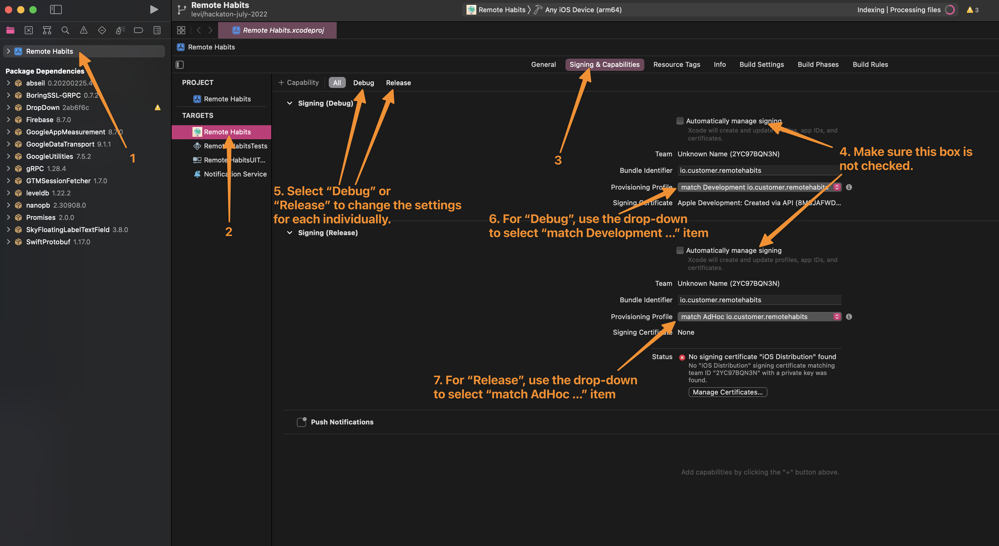
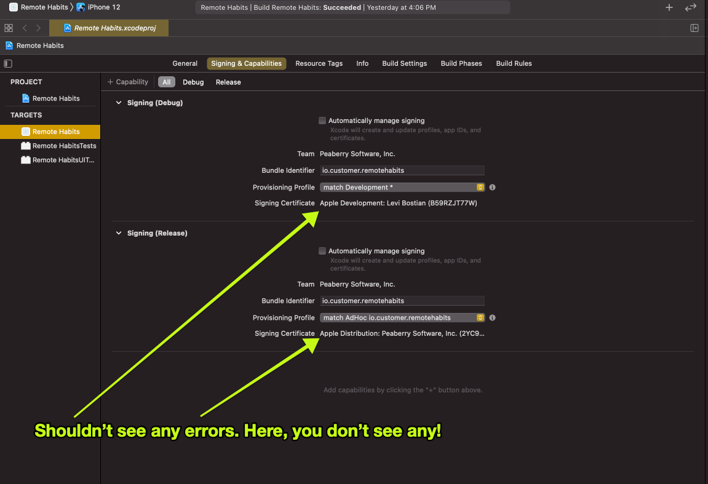
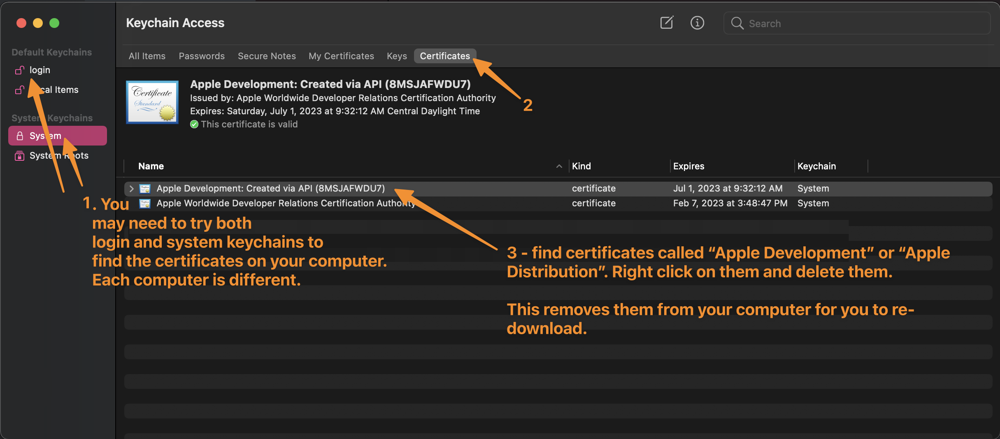

# apple-code-signing

Make iOS code signing easy for all of our iOS apps at Customer.io.

This project attempts to solve all problems on our team in regards to iOS code signing. Click on each of the sections below in this list to learn more.

1. **[Create a new iOS app in the company](#creating-a-new-ios-app)** - Each mobile developer in the company should be able to create a new iOS app. Especially as we build a collection of iOS sample apps, anyone should be empowered to add a new sample app to our code base. This includes creating code signing files for this new app!
2. **[Download code signing files to your development computer to be able to compile an iOS app](#development-code-signing)** - The goal is that you can run 1 command and then be able to compile an iOS app in Xcode.
3. **[Automate expired code signing files](#maintenance-of-code-signing-files)** - All iOS code signing files expire. When they do expire, you are no longer able to compile the iOS app until those files get re-created. To get ahead of this, this project has automated maintenance scripts that run periodically to re-create code signing files so we should never experience expired code signing files.
4. **[Prevent accidents from occurring to code signing files](#maintenance-of-code-signing-files)** - The CI server has write access to the Apple Developer account and Google Cloud Storage. All engineers have read-only access to these files. This workflow helps prevent anyone from making a change to the Apple Developer account and accidentally breaking code signing for iOS apps in the org.

Before we get into the specifies of this project and how it accomplishes all of these problems, here is a quick overview of the authentication process of our organization in regards to code signing files:

[](https://mermaid-js.github.io/mermaid-live-editor/edit#pako:eNp1kk1rAjEQhv_KkJOCWw-9LUVQV0oPpdAt9OD2MG5m12C-SLIFUf97JypCQQ-BYWbyvO9kchCtkyRK0Qf0W_iqGtvY-WjuvSao6Je08xQA29YNNr1swiyfZSBMFAGtBEmacpw5EFVvle2hU5pi7uxcAKaEPaiPGtD7cWMXo1fneuYvtRvkpRdicgF7gvoZNkO7o5tWzYUz3u_BdYBaP5AyyFll4YH3cZ5sue5V2g6bp9aZaTuwqKGg3BTznSJziyv3POYbRArs_geKYgbH76ASZR7FeIQ54-7lF1moWr-7DTsDsr2yRCHz5MWTIZvAYLvlwpX8SSgLZ_X-P2W1Xl49Pil3fsGIJk_Hfu8ZvIsRE8EAg0rymg-NBWhE2pKhRpQcSgy7RjT2xH04JFfvbSvKFAaaiMFL3nOlkH-HEWWHOt6yK6l4M9fk6Q_Ofs7f)

> Note: This process was not invented by us, but is how the popular tool [fastlane match](https://docs.fastlane.tools/actions/match/) works which is what this project uses under the hood.

This process is popular amongst iOS teams and gives us many great benefits.

1. **Less code signing files to manage** - For every iOS app, there should only be 2 files (development profile, adhoc profile) to manage. This is intead of N number of files where N is the number of developers and CI servers in the organization. Less files to manage not only makes the Apple Developer account cleaner, but also prevents common "It works on my computer" scenenarios with code signing on a development machine.
2. **More secure** - Giving write access to 1 only CI server allows teams to centralize authorization.
3. **Easier to use** - By using this process, all mobile engineers and CI server just needs to be authorized to access the Google Cloud file storage bucket in order to compile iOS apps. Because everyone in our organization already has a `@customer.io` Google account, this process is convenient and scalable.

# Creating a new iOS app

All iOS apps need to be registered with Apple through an [Apple Developer account](https://developer.apple.com/account/). Each iOS app has it's own unique *bundle identifier* (`io.customer.foo`, `io.customer.bar`, etc). So, in order for you to create a new iOS app for the CIO organization, you need to create a unique bundle identifier and register it with our company's Apple Developer Account.

On the mobile team, we share a common Apple developer account login to create new iOS apps. Find it in 1Password - "Mobile Shared Apple Developer Account login". Open a web browser and login at [`https://developer.apple.com/account/`](https://developer.apple.com/account/) with this shared Apple login to continue. **Note: Do not login to Xcode with this shared Apple Developer account, only a web browser.**

> Note: Apple only allows Apple accounts with *admin* permissions to register new iOS apps in a Apple Developer Account. Sharing 1 common Apple Developer account login is preferred over creating 2+ Apple accounts with admin permissions.

* **Register a new App ID**

Following [these instructions](https://developer.apple.com/help/account/manage-identifiers/register-an-app-id), create a new app in the company's Apple Developer account for this new iOS app.

For the bundle ID, have it start with `io.customer`. Make sure that this new bundle ID is unique not sharing the same bundle ID as any other bundle ID in the company's Apple Developer account. View [the list of existing bundle IDs in our Apple Developer account](https://developer.apple.com/account/resources/identifiers/list) for ideas and to make sure the new bundle ID is unique.

For the name of the app, try to be descriptive. A name such as "iOS sample FCM CocoaPods" describes the platform (iOS) and the sample app's purpose (FCM, CocoaPods). This helps our team manage all our iOS apps and delete ones we no longer use.

When asked about making a *Wildcard App ID*, do not select it. All app IDs should not be a wildcard as wildcards do not allow some features to be added to an iOS app.

When asked about what capabilities to add, you can select the *Push notifications* checkbox since your app will probably be using push notifications. You can keep all other checkboxes unchecked for now. You can modify capabilities at anytime for existing apps.

* **Create code signing files for the new App ID**

[Go to this webpage](https://github.com/customerio/apple-code-signing/actions/workflows/create-code-signing-files.yml) and run the workflow. The CI server will do all the work for you by fetching the new app id that you created and will create code signing files for the new app.

Wait for the CI server to finish running before moving to the next step.

* **Download the newly created code signing files to your development machine**

Follow the section in this doc [development code signing](#development-code-signing) to learn how to download these new code signing files to your development machine.

* **Open your new iOS app in Xcode and modify Xcode project settings**

Follow the instructions in these screenshots to select the correct code signing files for this app:



After you change these settings, you should not see any errors in Xcode:



Make sure to make a `git commit` so you can share this Xcode project change with the rest of the team.

# Development code signing

Want to compile an iOS app on your local development machine? This section goes over the details on how to do that.

> Note: Code signing files for the app that you want to compile should already be created. You just need to download these files to your computer. If you're developing a *new* iOS app, follow the instructions in this doc for [Creating a new iOS app](#creating-a-new-ios-app).

Code signing files are stored in a Google Cloud Storage bucket to allow convenient and secure access to the files by our team. To download these files, follow these instructions.

* Install the Google Cloud CLI to your computer using `brew install --cask google-cloud-sdk`.

*Note:* After running this command, follow the instructions [on this webpage regarding *PATH*](https://formulae.brew.sh/cask/google-cloud-sdk#default) to add the CLI to your PATH. Without doing this step, your computer will not be able to find the `gcloud` command.

* Run `gcloud auth application-default login` > a webpage should open asking you to login with your `@customer.io` Google account > After you login on the webpage, you should see a webpage message saying "You are now authenticated with the gcloud CLI!"
* Run `gcloud auth application-default print-access-token` as a way to check that you have successfully logged in. You should see a long string get printed out to the console and not see any error messages. This means that you have successfully logged into your `@customer.io` Google account on your development machine.
* In the root directory of your iOS project (where your Xcode project exists), run `fastlane download_development_code_signing`. This command should not ask you any questions or give you any errors.

You should see the message `All required keys, certificates and provisioning profiles are installed 🙌` appear which means that you successfully downloaded the code signing files to your machine for this 1 iOS app!

**If you get an error** `Could not find 'download_development_code_signing'`, add this code snippet to the top of the file `fastlane/Fastfile` in your iOS project:

```
# Import reusable functions that can used by all iOS apps in the team 
# https://docs.fastlane.tools/actions/import_from_git/
import_from_git(
  url: "git@github.com:customerio/apple-code-signing.git", 
  branch: "main", 
  path: "fastlane/Fastfile"
)
```

**If you get an error** `fastlane command not found`, install the Fastlane CLI with `gem install fastlane`.

* Open your iOS app in Xcode. The code signing settings for your Xcode project should already be configured to use the code signing files that you just downloaded. You should be able to compile your iOS app right now!

If you encounter code signing errors while trying to compile your app, view the section [Creating a new iOS app](#creating-a-new-ios-app) about how to modify your Xcode project settings to select the Debug and Release code signing provisioning profiles.

# Maintenance of code signing files

In order for our team to successfully compile all of our iOS apps on development machines and CI servers, the following requirements must all be met:

1. Code signing files have been created from the Apple Developer account for each iOS app.
2. A copy of all code signing files created in the Apple Developer account is stored in a Google Cloud storage bucket.
3. All code signing files must *not* be expired. All code signing files expire 1 year after being created and they must be deleted and re-created after they expire.

This project attempts to satisfy all of these needs in 2 ways.

### Create code signing files for each app and upload copy to Google Cloud storage bucket

If you create a new iOS app or are encountering issues with code signing files on your development machine, a good place to start is to make sure that code signing files have been created for the iOS app and that a copy of those files exist in Google Cloud storage.

To do this, all you need to do is [go to this webpage](https://github.com/customerio/apple-code-signing/actions/workflows/create-code-signing-files.yml) and run the workflow. The CI server will go through all iOS apps currently registered to the company's Apple Developer account and create the code signing files if they have not been created already and make sure a copy of those files exists in Google Cloud storage.

Once the CI server finishes, you can feel confident that valid code signing files exist in Google Cloud ready for you to download and use. Follow the section [development code signing](#development-code-signing) to learn how to download these files to your machine to compile the iOS app.

### Automatically scheduled re-creating of *all* iOS code signing files to prevent expired files

This project is setup on a schedule to automatically delete and re-create code signing files for all of our company's iOS apps before they expire to avoid downtime in building iOS apps. See `./.github/workflows/code-signing-maintenance.yml` if you want know the details on how this works.

Although code signing files are all deleted and re-created on an automated schedule, there are moments where you may need to manually run this operation to fix a code signing problem the team is encountering. You can do this by [going to this webpage](https://github.com/customerio/apple-code-signing/actions/workflows/code-signing-maintenance.yml) and run the workflow.

# Troubleshooting 

Although this project follows a process that tries to avoid code signing problems from occurring, there might be a scenario where someone is experiencing problems compiling an iOS app because of code signing problems. Here is a list of steps to try and get your issue resolved.

Try each of these steps in order from top to bottom. If you try a step and it doesn't work, try the next step. 

* **Reload Xcode** -

Quit Xcode (⌘Q), re-open Xcode, and open the Xcode project again. Check to see if the error is still showing up. Sometimes Xcode needs to re-load the code signing files on your computer and the errors go away. 

> Note: It's recommended to try reloading Xcode after each of the suggestions below. Reloading Xcode is common to solve lots of issues. 

* **Delete code signing certificates and re-download them** -

Open Keychain Access program on your computer. Follow these steps in the screenshot to find and delete your existing certificates on your computer. If you do not find any files, it's OK. 



Follow the instructions for [development code signing](#development-code-signing) to re-download the files to your computer. 

* **Restart your computer** - 

Yup. Turn if off and back on. It can fix your problem sometimes. 

* **Delete derived data** - 

[The many suggestions here](https://stackoverflow.com/questions/38016143/how-can-i-delete-derived-data-in-xcode-8) will guide you on how to delete *derived data* on your computer. Re-open Xcode after doing this. 

* **Make sure that code signing files have been created and a copy is available for you to download** - 

Follow the instructions [create code signing files and upload copy to Google Cloud](#create-code-signing-files-for-each-app-and-upload-copy-to-google-cloud-storage-bucket) to make sure that code signing files are available for you to download. There could be a sceario where Google Cloud storage bucket has the wrong copy of a file. 

Follow the instructions for [development code signing](#development-code-signing) to re-download the files to your computer. 

* **Is the correct code signing files selected in the Xcode project?** - 

Follow the instructions for [creating a new iOS app](#creating-a-new-ios-app) to learn how to verify your Xcode project has the correct code signing files selected for your app. 

* **Delete all code signing files and re-create them** - 

If you have tried all of the steps above, there might be a larger problem happening with code signing files and it's easiest to delete them all and start over. 

Follow the instructions in [re-creating all iOS code signing files](#automatically-scheduled-re-creating-of-all-ios-code-signing-files-to-prevent-expired-files) to *manually* run code signing files maintenance. This will have all code signing files deleted and re-created. There might have been a bad code signing file created and needs to be deleted and re-created. 
